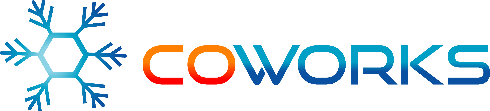

|

.. image:: https://travis-ci.com/gdoumenc/coworks.svg?branch=dev
  :target: https://travis-ci.com/gdoumenc/coworks
  :alt: Travis CI
.. image:: https://readthedocs.org/projects/coworks/badge/?version=dev
  :target: https://readthedocs.org/projects/coworks/
  :alt: Documentation Status
.. image:: https://codecov.io/gh/gdoumenc/coworks/branch/dev/graph/badge.svg
  :target: https://codecov.io/gh/gdoumenc/coworks
  :alt: Documentation Status

CoWorks is an unified compositional microservices framework over AWS technologies and
based on the `Chalice <https://github.com/aws/chalice>`__ microframework.
The aim of this project, is to offer a very simplified experience of microservices over the awesome technologies of AWS.

Each atomic microservice (Tech Microservice) is a simple python class deployed as serverless Lambda and
composition of microservices (Biz Microservice) is performed over the Step Function product.

You can get a quickstart on `TechMicroService <https://coworks.readthedocs.io/en/latest/tech_quickstart.html>`_ then
continue with `BizMicroService <https://coworks.readthedocs.io/en/latest/biz_quickstart.html>`_

Documentation
-------------

* Get started: `Installation <https://coworks.readthedocs.io/en/latest/installation.html/>`_
* Complete reference guide: `Documentation <https://coworks.readthedocs.io/en/latest/>`_.
* Read `FAQ <https://coworks.readthedocs.io/en/latest/faq.html/>`_ for other informations.

Contributing
------------

If you want to contribute to this project in any kind, your help will be very welcome.
Don't hesitate to contact any project's member.

Related Projects
----------------

* `Chalice <https://github.com/aws/chalice>`_ - Python Serverless Microframework for AWS.
* `Terraform <https://github.com/hashicorp/terraform>`_ - Infrastructure configuration management tool.
* `SCons <https://github.com/SCons/scons>`_ -  A software construction tool.

