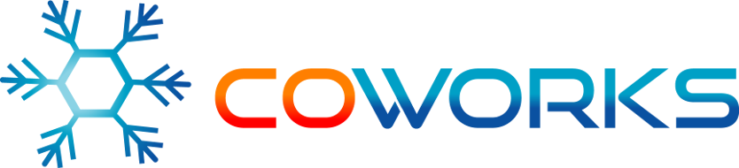

Introduction
============

Coworks is a unified serverless microservices framework based on AWS technologies.

Each atomic microservice (defined as ``class TechMicroService``) is a simple python class deployed as a serverless AWS Lambda, and
composition of microservices (defined as ``class BizMicroService``) is performed over the AWS Step Function product.

Other AWS technologies are used for logging, administration, ...

Documentation
-------------

* Get started: :ref:`installation`.
* Quick overview: :ref:`tech_quickstart` then :ref:`biz_quickstart`.
* The Command Line Interface :ref:`cli`.
* At least :ref:`faq` if not enough...

Using and derived from `Chalice <https://github.com/aws/chalice>`_ and some ideas from
`Flask-Classy <https://github.com/apiguy/flask-classy/>`_.

Other tools used:

* `Click <https://github.com/pallets/click>`_ - Command Line Interface Creation Kit.
* `Terraform <https://github.com/hashicorp/terraform>`_ - Infrastructure Configuration Management Tool.

What does microservice mean in Coworks?
****************************************

In short, the microservice architectural style is an approach to developing a single application as a suite of small services,
each running in its own process and communicating with lightweight mechanisms.

In Microservice Architecture (Aligning Principles, Practices, and Culture),
authors M. Amundsen, I. Nadareishvili, R. Mitra, and M. McLarty add detail to the definition
by outlining traits microservice applications share:

* Small in size
* Messaging enabled
* Bounded by contexts
* Autonomously developed
* Independently deployable
* Decentralized
* Built and released with automated processes

In Coworks, microservices are serverless services over APIs.

Small in size
  Simply implemented as a python class.

Messaging enabled
  API Gateway request-response managed services.

Service oriented
  Technological service on Lambda and Functional service over Step Function.

Independently deployable
  All needed deployment information defined in the python class.

Decentralized
  Serverless components.

Smart endpoints
  Deriving directly from class methods.

What are Coworks main benefits?
*******************************

Like any model of software architecture, it is very usefull to have complementary tools for programming, testing,
documenting or deploying over it.

The main advantage of using Coworks is its ability to defined tools around the microservices defined by code.
Prédefined tools like `run` or `deploy` are provided, but you can redefined them or creates new ones like for
documentation or testing.

For more details, see: :ref:`command`.

Two levels of microservice
**************************

Coworks microservices are divided in two categories :

**Small technical microservice**

  Implemented as a simple AWS Lambda function, this kind of microservice is dedicated to technical
  operations over a specific service.

**Functional business microservice**

  Implemented over AWS Step Function, this kind of microservice allows non programmer to construct
  functional business workflows.

Distinction between ``TechMicroservice`` and ``BizMicroservice`` is based not only on granularity size but also:

* A ``TechMicroservice`` should only be used as receivers of orders coming from ``BizMicroservices``.
* A ``BizMicroservice`` represents a logical workflow of actions while a MicroService represents a simple concrete action.
* A ``TechMicroservice`` is an independant microservice while a ``BizMicroservice`` is connected to event handlers (cron, notification, event, ...).
* A ``TechMicroservice`` is more a handler pattern and ``BizMicroservice`` a reactor pattern.

Documentation
=============

.. toctree::
  :maxdepth: 2
  :caption: Contents:

  installation
  tech_quickstart
  tech
  command
  configuration
  biz_quickstart
  biz
  api
  faq
  contributing
  changelog

Taking part in the project
==========================

If you want to contribute to this project in any kind, your help will be very welcome.
Don't hesitate to contact any project's member.

Indices and tables
==================

* :ref:`genindex`
* :ref:`modindex`
* :ref:`search`
